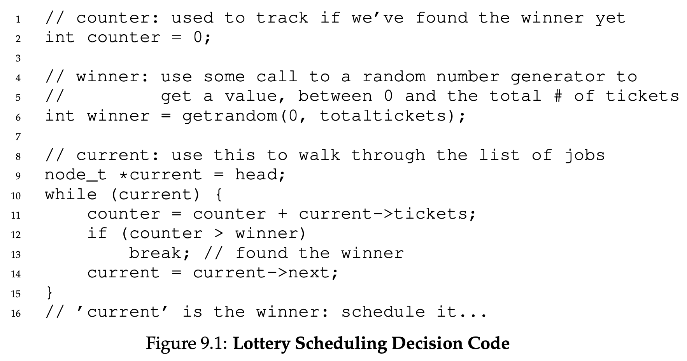
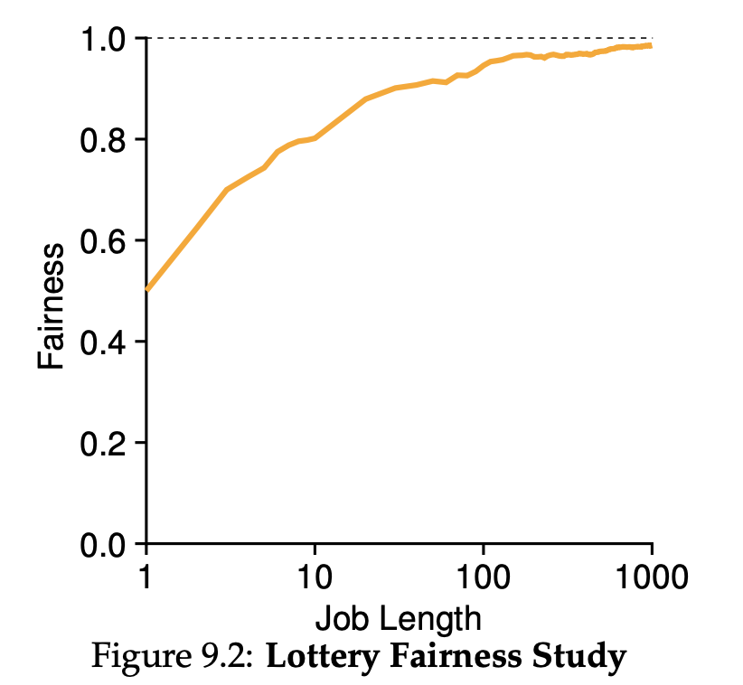
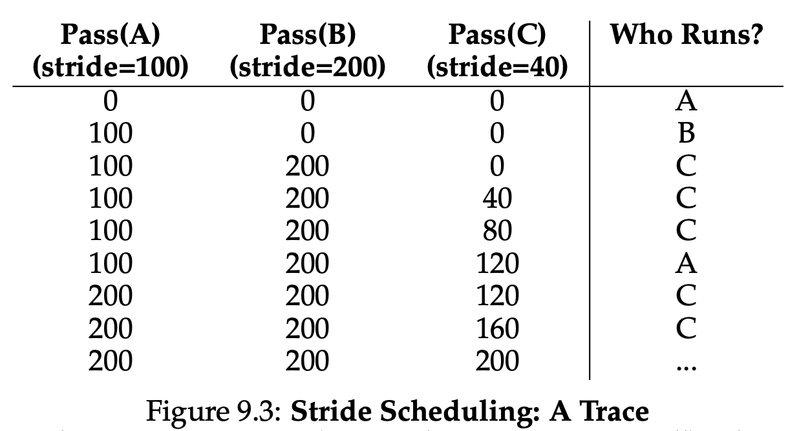

# 09 Scheduling: Proportional Share

이번 파트에서는 Proportional-Share Scheduler에 대해서 알아볼 것이다.
일반적으로 Fair-Share Scheduler라고 알려져있다.

Proportional-Share는 Turnaround Time과 Response Time을 최적화하는 것이 아니라 각각의 작업이 CPU Time을 특정비율만큼 점유하도록 하는 것이다.

Proportional-Share Scheduler의 종류로 Lottery Scheduling이 있다.
기본적인 아이디어는 어떤 프로세스를 다음에 실행할지 결정하는 복권이 있다.
그리고 자주 실행해야하는 Process는 당첨될 확률이 더 높다.
아직 이해가 안되겠지만 하나씩 살펴보도록 하겠다.

## 09-01 Basic Concepts: Tickets Represent Your Share

Lottery Scheduling에서 티켓은 Resource에 대한 지분을 의미한다.
따라서 Process가 가진 티켓의 비율은 시스템 리소스를 사용할 수 있는 비율을 의미한다.

예를 들어 두 개의 Process A, B가 있다고 해보자.
A가 75 B가 25개를 가지고 있다면 A는 리소스의 75% B는 25%를 사용할 것이다.

Lottery Scheduling은 Deterministic하지 않고 Probabilistically하며 매 Time Slice마다 티켓을 집는다.
Scheduler는 티켓이 전체 얼마나 있는지 알고 그 중 하나를 선택한다. (0 ~ 99까지 존재)
A가 0 ~ 74의 티켓을 B가 75 ~ 99의 티켓을 가지고 있다고 해보자.

그리고 다음과 같이 티켓이 선택했다고 해보자.

```
63 85 70 39 76 17 29 41 36 39 10 99 68 83 63 62 43 0 49 12
```

그럼 Scheduler는 다음과 같이 프로세스를 실행시킬 것이다.

```
A B A A B A A A A A A B A B A A A A A A
```

이 예시를 통해서 알 수 있듯이 B는 약 20%의 자원을 할당받는다.
25%의 자원을 기대했지만 실제 할당은 이보다 적게 받은 것이다.


## 09-02 Ticket Mechanisms

Lottery Scheduling은 여러가지 티켓관리 방법을 제공한다.
그 중 한가지 컨셉은 Ticket Currency이다.
Currency는 티켓집합을 가지고 있는 사용자에게 그들이 가지고 있는 작업에 티켓을 분배하도록 자율권을 주는 것이다.
그리고 시스템이 각 사용자에서 사용하는 Currency를 글로벌값으로 변경해준다.

예를 들어 사용자 A, B가 있으며 각 사용자는 100 티켓을 가지고 있다.
사용자 A는 A1, A2의 작업을 실행하고 있고 A가 가직 Currency로 각 작업에 500 티켓씩 준다.
사용자 B는 하나의 작업만 실행하며 해당 작업에 10 티켓을 준다.
시스템은 A1, A2가 부여받은 500 티켓을 글로벌 티켓 50개로 변경한다.
마찬가지로 B가 사용했던 10티켓은 100티켓으로 변경한다.

```
User A -> 500 (A’s currency) to A1 ->  50 (global currency)
       -> 500 (A’s currency) to A2 ->  50 (global currency)
User B ->  10 (B’s currency) to B1 -> 100 (global currency)
```

다른 방법은 Ticket Transfer이다.
Process이 일시적으로 자신이 보유한 티켓을 다른 프로세스에게 넘길 수 있는 기능이다.
클라이언트-서버 상황에서 효과적이다.
클라이언트가 서버에 특정작업에 대해서 요청을 보냈다.
작업속도를 높이기 위해서 클라이언트가 가진 티켓을 서버에 넘길 수 있다.
그리고 서버가 작업이 끝나면 티켓을 클라이언트에 다시 돌려준다.

마지막으로 Ticket Inflation이 있다.
Process는 티켓의 수를 조절할 수 있다.
물론 다른 Process와 경쟁하는 상황속에서 Process가 다른 Process의 티켓수를 믿지 않는다면 이 기능은 설득력이 떨어진다.
하나의 탐욕적인 Process가 많은 수의 티켓을 가져갈 수 있으며 CPU를 독점할 수도 있다.
서로를 신뢰할 수 있는 Process 그룹이라는 전제가 있어야 이 방법을 사용할 수 있다.
만약 신뢰하는 다른 Process가 CPU가 더 필요하다면 해당 프로세스는 티켓의 값을 늘리고 시스템에 자원을 요구한다.
그리고 별도의 통신없이 해당 리소스를 할당받을 것이다.


## 09-03 Implementation

Lottery Scheduler를 구현하기 위해서는 Random Number Generator와 시스템의 Process를 트래킹할 수 있는 자료구조가 필요하다.

Process List를 가지고 있다고 가정하겠다.
다음과 같이 세 개의 Process A, B, C가 있으며 각각의 Process는 임의의 티켓수를 보유하고 있다.

```
# linked list structure
head -> Job: A(Ticket 100) -> Job: B(Ticket: 50) -> Job: C(Ticket:250) -> NULL
```

Scheduling Decision을 하기 위해서는 전체 티켓 수 400에 대해서 Random Number를 생성해야한다.
예를 들어 300을 뽑았다고 가정해보자.

아래의 Figure 9.1과 같이 Counter를 활용하여 Process List를 탐색할 수 있다.


Process List를 `counter`의 값이 `winner`를 초과할 때까지 탐색한다.
`counter`의 값이 `winner`를 초과하면 `current`가 `winner`가 된다.
만약 `winner`가 300이라면  `counter`는 우선 100까지 증가할 것이다. (A 범위 탐색 하지만 winning ticket은 될 수 없다.)
그리고 `counter`는 150까지 증가할 것이다. (B 범위 탐색)
이 역시 300보다 작기 때문에 탐색은 계속된다.
`counter`가 400이 되면 비로소 `current`가 `winner`가 된다.
그리고 `current`는 C이다.

위의 로직을 더 효율적으로 만들기 위해서는 Sorting이 필요할 것이다.
내림차순으로 Sorting하게 되면 더 효율적이다.
하지만 이런 정렬이 알고리즘의 정확도에는 영향을 끼치지 않는다.

## 09-04 An Example

Lottery Scheduling을 더 잘 이해하기 위해서 서로 경쟁적인 관계를 가지는 작업을 가지고 생각해볼 것이다.
두 작업은 모두 같은 Running Time을 가지고 있으며 같은 수의 티켓을 가지고 있다.

해당 예시에서 두 작업이 거의 유사한 시간에 끝나도록 스케쥴링할 것이다.(Lottery Scheduling의 불확실성때문에 한작업이 다른 작업보다 일찍 끝날 수 있다.)
두 작업이 끝나는 시간의 차이를 정량적으로 측정하기 위해서 Faireness라는 매트릭을 정의할 것이다.

$$
F = \frac{\text{첫 번째 작업이 끝난 시간}}{\text{두 번째 작업이 끝난 시간}}
$$

만약 첫 번째 작업이 10초에 끝나고 두 번째 작업이 20초에 끝났다면 $\frac{10}{20}$의 Fairness를 가진다.
첫 번째 작업과 두 번째 작업이 거의 동시에 끝났다면 Fairness는 1에 수렴할 것이다.

아래의 그래프는 작업의 길이와 Fairness의 값에 관계를 표현했다.



그래프에서 알 수 있듯이 작업의 길이가 짧으면 Fairness가 낮고 작업의 길이가 늘어날 수록 Fairness가 증가하는 것을 확인할 수 있다.


## 09-05 How to Assign Tickets?

그렇다면 어떻게 작업에 티켓을 배분할까?
한가지 방법은 사용자에게 권한을 맡기는 것이다.
사용자가 작업에 대해서 가장 잘 알 것이라 가정하고 작업에 티켓을 배분하도록 한다.
하지만 이 방법은 해결책이라 부르기에는 명확하지 않다.
따라서 아직까지는 티켓배분문제는 해결되지 않았다.

## 09-06 Stride Scheduling

Lottery Scheduler는 티켓을 배분하고나서 랜덤으로 티켓을 뽑는다.
그렇다면 왜 랜덤하게 뽑을까?
사실 랜덤하다면 정확하게 비율대로 작업이 실행되는 것을 보장하지 못한다.
이런 이유로 Stride Scheduling이 제안되었고 Deterministic한 알고리즘이다.

Stride Scheduling에서는 각 작업들은 Stride를 가지고 있으며 이는 작업이 가지고 있는 티켓수에 반비례한다.
예를 들어 A, B, C 작업이 있고 각각 티켓을 100, 50, 250개를 가지고 있다고 했을 때,
Stride는 어떤 한 큰 숫자를 가지고 있는 티켓수로 나누어 구하게 된다.
만약 10000을 가지고 있는 티켓수로 나눈다면 A, B, C의 Stride는 각각 100, 200, 40가 된다.
Process가 동작할 때마다 카운터는 증가할 것이고 카운터 값이 증가하면 이에 Stride * Counter를 하여 Pass Value가 결정된다.
또한 이를 통해서 글로벌 진행상황을 파악할 수 있다.

Stride Scheduler는 Stride를 사용하고 어떤 프로세스를 다음에 실행시킬지 결정한다.
기본적인 아이디어는 간단하다.
주어진 시간에 실행시킬 Process를 뽑는다.
여기서 실행시킬 Process라는 것은 가장 낮은 Pass Value(Counter * Stride)를 가진 작업을 의미한다.
의사코드는 다음과 같다.

```
curr = remove_min(queue);   // pick client with min pass
schedule(curr);             // run for quantum
curr->pass += curr->stride; // update pass using stride
insert(queue, curr);        // return curr to queue
```

위의 A, B, C 작업의 예시를 보면 아래와 같다.



처음에는 A, B, C 모두 Pass Value가 0이므로 A를 뽑았다고 가정했다.
두 번재는 B, C중 B를 뽑았다고 가정하고
나머지는 위의 의사코드를 그대로 진행한 것이다.

위에서 보이는 것처럼 C가 5번 실행되며 이는 낮은 Stride값을 가지기 때문에 그렇다.

다시 Lottery Scheduling과 Stride Scheduling을 비교해보자.
사실 Lottery Schdueling은 Stride Schdueling이 가지고 있지 않은 좋은 성질을 가지고 있다.
Global State를 파악할 필요가 없다는 게 장점이다.