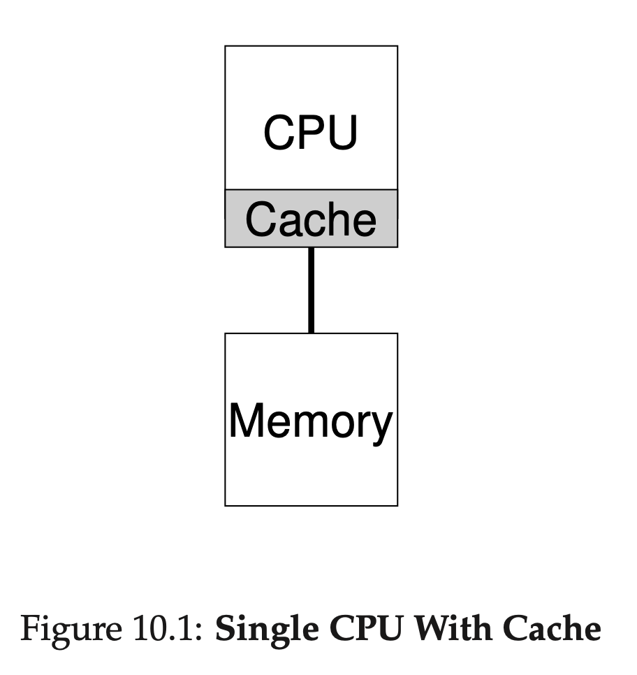
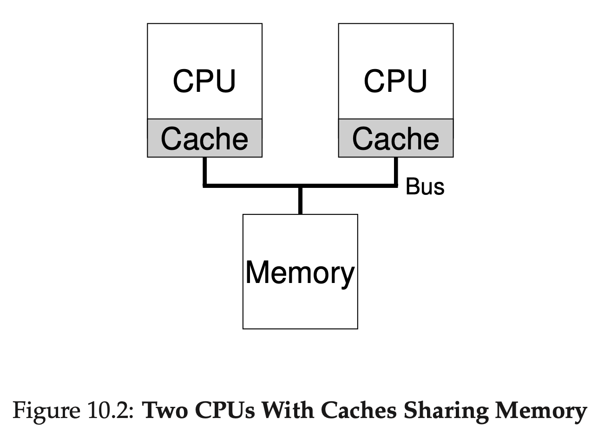
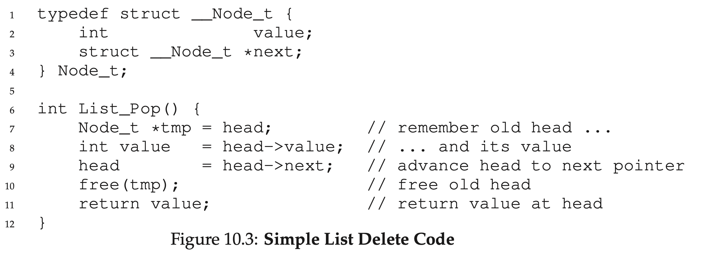
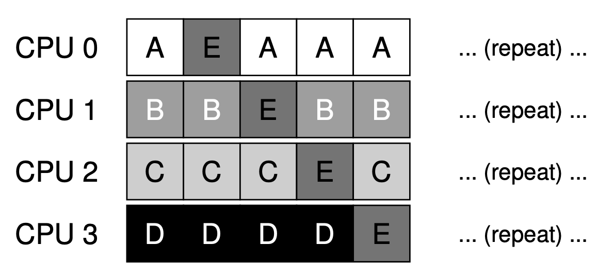
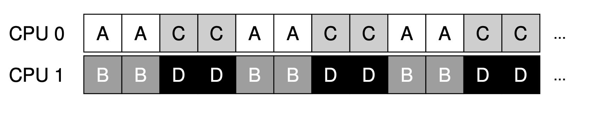
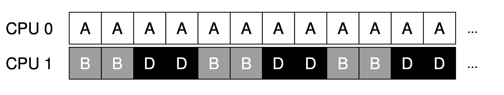
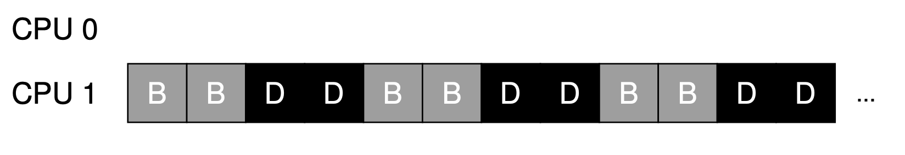
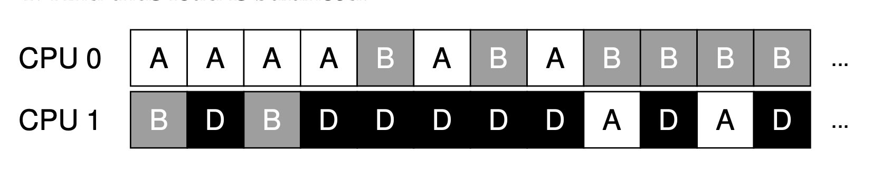

# 10 Multiprocessor Schedulingß

본 장에는 Multiprocessor Scheduling을 다뤄볼 것이다.

Multiprocessor 환경은 Single Processor에 비해서 복잡하고 여러문제를 가지고 있을 수 있다. (물론 성능적인 측면에서 더 뛰어날 것이다.)

대표적으로 전형적인 어플리케이션은 싱글 코어환경을 전제로 구현한다.
따라서 추가적인 코어가 있다고 해서 해당 어플리케이션이 빨라지는 것이 아니다.
만약 멀티코어의 이점을 살리고 싶다면 병렬로 실행할 수 있도록 재구현해야한다.

또 하나의 이슈는 Multiprocessor의 Schduling 문제이다.

## 10-01 Background: Multiprocessor Architecture

Multiprocessor와 Single Processor의 Scheduling 이슈를 살펴보기전에 아키텍쳐에 대한 이해를 해볼 것이다.

Single CPU 하드웨어와 Multi CPU 하드웨어의 차이점 중 캐시를 주목해보자.





Single CPU를 사용하는 시스템상에서 하드웨어 프로그램실행을 빠르게 하기 위한 캐시의 계층이 있다.
캐시는 작고 빠른 메모리이며 메인 메모리상에서 빈번하게 사용되는 데이터를 복사해서 가지고 있는다.
반면에 메인 메모리의 경우 모든 데이터를 가지고 있으며 접근이 느리다.
빈번하게 사용되는 데이터를 캐시에 보관함으로서 시스템은 크고 느린 메모리가 빠른 것처럼 보이게 할 수 있다.

예를 들어 메모리로 부터 데이터를 패치하는 인스트럭션을 가지고 있는 프로그램을 상상해보자. (Single CPU)
처음에는 프로그램은 메인 메모리로부터 데이터를 로드할 것이다.
그리고 로드하는데 꽤 긴 시간이 걸릴 것이다.

하지만 데이터가 재사용 될 것이라고 Processor가 예측한다면 로드한 데이터를 CPU Cache에 저장할 것이다.
다음에 똑같은 데이터에 대해서 패치하라는 명령을 가진 프로그램을 실행하면 CPU는 먼저 캐시를 확인한 후 캐시에 해당 데이터가 있음을 확인할 것이다.
그 후 메인메모리에서 데이터를 가져오는 것이 아니라 캐시에서 데이터를 가져올 것이다.
이렇게 되면 프로그램을 전보다 더 빠르게 실행할 수 있다.

캐시는 Locality 성격을 가진다.
- Temporal Locality: 데이터의 일부에 접근했다면 가까운 미래에 해당 데이터에 접근할 수 있다.(ex) Loop문)
- Spatial Locality: 데이터를 주소 x에서 접근했다면 x근처 데이터에 접근할 확률이 높다. (ex) Array)


그렇다면 Multi CPU경우 캐시는 어떻게 진행할까? (더 복잡할 것이다.)

예를 들어  CPU1에서 동작중인 프로그램이 있다고 해보자.
이 프로그램은 A Address에서 D 값을 읽어본다.
CPU1 캐시에 D가 없기 때문에 시스템은 메인 메모리 A Address에서 D 값을 읽어온다.

그런다음 A Address의 값을 `D'` 로 변경하기 위해서 CPU1 캐시를 `D`값을 `D'`로 변경한다.
메인 메모리에 값을 항상 업데이트 하는 것은 비효율적이기 때문에 캐시에만 적용한다.
그 후 시스템이 해당 프로그램을 정지한후 CPU2에서 실행하기로 결정했다.
CPU2의 캐시에는 관련 데이터가 없기 때문에 메인메모리에서 `D`값을 가져온다. (최신 데이터는 `D'`이다)

이런 문제를 Cache Coherence라고 한다.

가장 기본적인 해결책은 하드웨어로 부터 제공된다.
메모리 접근을 모니터링함으로서 하드웨어는 올바른 데이터를 알 수 있다.
가장 대표적인 방법은 Bus-Based System이다.

각 캐시는 캐시들과 메인메모리와 연결된 버스를 관측하면서 메모리 업데이트를 지켜본다.
만약 CPU가 캐시상 데이터를 업데이트하는 것을 본다면 이 변화를 알리고 데이터를 업데이트할 것이다.





## 10-02 Don't Forget Synchronization

Program이 Shared Data에 접근할 때 유의할 점은 무엇일까?
사실 이 질문은 이 책의 두 번째 파트인 Concurrency와 직결되는 질문이다.
따라서 현재파트에서는 큰 그림 위주로 살펴보고 두 번째 파트에서 더 자세히 다루도록 하겠다.

Shared Data 혹은 CPU간의 구조물에 접근할 때 정확성을 보장하기 위해서 Mutual Exclustion Primitive(Lock과 같은 장치)가 필요할 수 있다.
예를 들어 동시에 복수의 CPU가 접근하는 큐가 있다고 가정해보자.
Lock이 없다면 큐에 더하거나 제거하는 동시동작이 제대로 작동할 수 없다. (동시에 두 CPU가 하나의 요소를 제거하고자 할 때 두개의 요소가 제거될 수 있다.)
다른 CPU가 업데이트할 때 기다렸다가 다음동작을 진행해야 의도한대로 작동할 것이다.

더 구체적인 예시로는 아래의 코드를 살펴보자.
해당 예시는 Shared Linked List에서 하나의 요소를 삭제하는 코드이다.


쓰레드1이 첫번째 라인을 실행할 것이다.
`tmp` 변수에 `head`의 값을 저장한다.
만약 쓰레드2 또한 첫번째 라인을 실행한다면 해당 쓰레드또한 `tmp` 변수에 `head`값을 저장한다.
그렇게 되면 두 쓰레드는 모두 값은 값을 제거하려한다. (Double Free)

Lock을 통해서 위의 문제를 해결할 수 있다.
- Simple Mutex
- `lock(&m)`: 루틴 시작점
- `unlock(&m)`: 루틴 끝

하지만 위의 방법은 성능상 이슈가 있다.
다른 쓰레드의 접근을 제한하기 때문에 성능이 떨어진다.


## 10-03 One Final IssueL Cache Affinity

마지막 이슈는 Cache Scheduler와 관련된 Cache Affinity 이슈이다.
특정 CPU에서 실행중인 Process는 CPU의 Cache에 상태정보를 구축한다.
다음에 Process가 실행할 때 같은 CPU에서 실행시키는 것은 상당한 이점을 준다.
캐시에 저장된 데이터가 있기 때문에 더 빠르게 Process를 실행시킬 수 있다.

매번 다른 CPU에서 Process를 실행시킨다면 Cache에 있는 정보를 활용할 수 없고 메인 메모리에서 데이터를 로드해야한다.
그러므로 Multiprocessor Scheduler는 Cache Affinity를 고려하여 스케쥴링 결정을 해야한다. (가능한 같은 CPU에서 동작할 수 있도록)

## 10-04 Single-Queue Scheduling

Multiprocessor Scheduling 알고리즘에 대해서 다룰 것이다.
가장 기본적으로 Single-Queue Multiprocessor Scheduling이 있다. (SQMS)
이 접근법은 간단하다는 장점이 있다.

하지만 몇가지 한계가 있다.
이 방법은 확장성이 떨어진다.
복수의 CPU에서 Scheduling이 정상적으로 작동하는 것을 보장하기 위해서 개발자는 코드에 Lock을 걸어야한다.
Lock을 걸게 되면 성능이 떨어진다는 문제가 있다.
CPU의 수가 늘어날수록 상대적으로 더 비효율적으로 사용하게 될 것이다.

두 번째 문제는 Cache Affinity이다.
A, B, C, D, E 작업이 있다고 가정해보자.
큐는 아래와 같이 생길 것이다.

```
# Single Queue
Queue -> A -> B- > C -> D -> D -> Null
```

각 작업은 아래 이미지처럼 CPU마다 분배되서 실행될 수 있다.


CPU는 전역적으로 공유되는 큐로부터 다음 작업을 선택한다.
위와 같이 선택하게 되면 Cache를 효율적으로 활용할 수 없게되고 이는 성능저하로 이어진다.

이런 문제를 해결하기 위해서 SQMS는 Affinity Mechanism을 사용한다.
가능한 같은 CPU에서 Process를 실행시키도록 하는 것이다.



## 10-05 Multi-Queue Scheduling

SQMS의 한계 때문에 몇몇 시스템은 Multiple-Queue를 사용한다. (CPU마다 큐를 생성하여 사용)
이런 방법론을 Multi-Queue MultiProcessor Scheduliing(MQMS)라고 한다.

각 큐마다 Scheduling Decision이 독립적으로 발생한다.
정보를 공유하지 않기 때문에 동기화문제는 일어나지 않는다.

예를 들어 두 개의 CPU로 구성된 시스템이 있다고 해보자.
A, B, C, D 작업이 시스템에 있고 시스템은 아래와 같이 큐를 구성했다.

```
Q0 -> A -> C
Q1 -> B -> D
```

Queue Scheduling 정책에 따라서 각 CPU는 두 작업중 어떤 작업을 실행시킬지 결정한다.




MQMS는 SQMS에 비해서 확장성이 뛰어나다.
CPU 개수가 많아짐에 따라 큐의 개수도 늘어난다.
그러므로 Lock이나 Cache Contention은 크게 문제되지 않는다.

게다가 MQMS는 Cache Affinity도 보장한다.
같은 작업을 같은 CPU상에서 실행시킨다.

하지만 문제점 또한 가지고 있다.
바로 부하가 균등하게 분포되지 않을 수 있다는 점이다.

아래와 같이 작업이 분포해 있다고 해보자.

```
Q0 -> A
Q1 -> B -> D
```



A작업이 먼저 끝나게 되면 CPU0은 아무작업도 안하게 있게 되며 이는 비효율적이다.

```
Q0 ->
Q1 -> B -> D
```



어떻게 이런 문제를 해결할 수 있을까?
Migration을 하면 이런 문제를 해결할 수 있다.
Migration이란 하나의 CPU에 있던 작업을 다른 CPU로 옮기는 것이다.

Migration은 크게 두 종류가 있다.
- Single Migration: 단발성으로 일어난다.
- Continuous Migration: 지속해서 일어난다.

아래와 같은 경우 Single Migration으로 B 혹은 D 작업을 CPU0으로 옮기면 된다.
```
Q0 ->
Q1 -> B -> D
```

하지만 아래와 같은 경우는 어떻게 해야할까?

```
Q0 -> A
Q1 -> B -> D
```
이런 경우 지속적으로 관찰하면서 작업을 유연하게 옮겨줘야한다.



그리고 Migration에는 여러가지 테크닉이 존재한다.
가장 대표적인 접근은 Work Stealing이다.
Source Queue가 Target Queue의 상태를 보고 Source Queue보다 많은 작업이 있으면 Target Queue의 작업을 가져와서 처리해준다.
다른 것들과 마찬가지로 너무 자주 작업을 가져오거나 너무 늦게 가져온다면 여러가지 문제가 있다.
따라서 적절한 임계점을 찾아 설정해주어야한다.

## 10-06 Linux Multiprocessor Schedulers

재밌게도 Linux Community에서는 Multiprocessor Scheduling에 대해서 공통된 해결책이 없다.
아직까지 세 가지 다른 Scheduler가 생겨났다.

1. O(1) Scheduler: Multiple Queue, Priority Based Scheduler
2. Completely Fair Scheduler: Multiple Queue, Detrministic Proportional Share
3. BF Scheduler: Single Queue